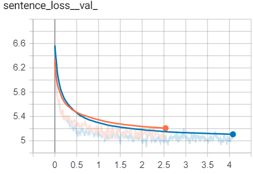
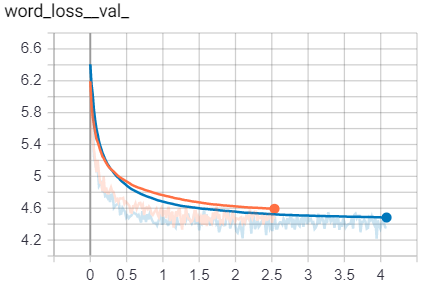

# AttnGAN

### Note
The key to solving the task in understanding GAN architectures described in these whitepapers and basic knowledge of natural language processing. 

The first whitepaper describes Attention's approach to text-based image generation based on GAN.  AttnGAN can synthesize fine-grained details on different sub-regions of the image, paying attention to the corresponding words in the description of the text in the natural language. However, this approach requires text pre-processing due to high noise levels. The solution described in this whitepaper is based on TF/IDF. The key module in architecture is the Deep Attentive Multimodal Similarity Model (DAMSM) capable of calculating similarity between the generated image and sentence. The model also represents an additional loss function for GAN learning.


The second whitepaper uses a Zero-Shot learning approach to a GAN-based classification task from previously unseen text categories based on Wikipedia raw articles. TF/IDF is also used for text preprocessing. The key feature of this solution is the text encoding module. It is based on an additional FC layer, which reduces dimensionality and suppresses noise. The presence of this layer provides an increase in accuracy of 2-3% compared to its absence.


As a result of whitepaper's analysis, FC layer was added to text encoding module, project ported to Python 3 (Python 2 is no longer supported since January 2020), dependencies were upgraded to stable versions, warnings and visualization errors were fixed and Tensorboard 2.1.0 support was added to DAMSM. As a result, the convergence of the validation loss function in the DAMSM model was 3-5% more successful in terms of sentence loss and word loss, which in my opinion is a critical indicator for this architecture.




### Implementation

Pytorch implementation for reproducing AttnGAN results in the paper [AttnGAN: Fine-Grained Text to Image Generation
with Attentional Generative Adversarial Networks](http://openaccess.thecvf.com/content_cvpr_2018/papers/Xu_AttnGAN_Fine-Grained_Text_CVPR_2018_paper.pdf) by Tao Xu, Pengchuan Zhang, Qiuyuan Huang, Han Zhang, Zhe Gan, Xiaolei Huang, Xiaodong He. (This work was performed when Tao was an intern with Microsoft Research). 


### Dependencies
Python 3

Pytorch >=1.5

In addition, please add the project folder to PYTHONPATH and `pip install` the following packages:
- `python-dateutil`
- `easydict`
- `pandas`
- `torchfile`
- `nltk`
- `scikit-image`
- `tensorboard`


**Data**

1. Download our preprocessed metadata for [birds](https://drive.google.com/open?id=1O_LtUP9sch09QH3s_EBAgLEctBQ5JBSJ) [coco](https://drive.google.com/open?id=1rSnbIGNDGZeHlsUlLdahj0RJ9oo6lgH9) and save them to `data/`
2. Download the [birds](http://www.vision.caltech.edu/visipedia/CUB-200-2011.html) image data. Extract them to `data/birds/`
3. Download [coco](http://cocodataset.org/#download) dataset and extract the images to `data/coco/`


**Training**
- Pre-train DAMSM models:
  - For bird dataset: `python pretrain_DAMSM.py --cfg cfg/DAMSM/bird.yml --gpu 0`
  - For coco dataset: `python pretrain_DAMSM.py --cfg cfg/DAMSM/coco.yml --gpu 1`
 
- Train AttnGAN models:
  - For bird dataset: `python main.py --cfg cfg/bird_attn2.yml --gpu 2`
  - For coco dataset: `python main.py --cfg cfg/coco_attn2.yml --gpu 3`

- `*.yml` files are example configuration files for training/evaluation our models.


**Pretrained Model**
- [DAMSM for bird](https://drive.google.com/open?id=1GNUKjVeyWYBJ8hEU-yrfYQpDOkxEyP3V). Download and save it to `DAMSMencoders/`
- [DAMSM for coco](https://drive.google.com/open?id=1zIrXCE9F6yfbEJIbNP5-YrEe2pZcPSGJ). Download and save it to `DAMSMencoders/`
- [AttnGAN for bird](https://drive.google.com/open?id=1lqNG75suOuR_8gjoEPYNp8VyT_ufPPig). Download and save it to `models/`
- [AttnGAN for coco](https://drive.google.com/open?id=1i9Xkg9nU74RAvkcqKE-rJYhjvzKAMnCi). Download and save it to `models/`

- [AttnDCGAN for bird](https://drive.google.com/open?id=19TG0JUoXurxsmZLaJ82Yo6O0UJ6aDBpg). Download and save it to `models/`
  - This is an variant of AttnGAN which applies the propsoed attention mechanisms to DCGAN framework. 

**Sampling**
- Run `python main.py --cfg cfg/eval_bird.yml --gpu 1` to generate examples from captions in files listed in "./data/birds/example_filenames.txt". Results are saved to `DAMSMencoders/`. 
- Change the `eval_*.yml` files to generate images from other pre-trained models. 
- Input your own sentence in "./data/birds/example_captions.txt" if you wannt to generate images from customized sentences. 

**Validation**
- To generate images for all captions in the validation dataset, change B_VALIDATION to True in the eval_*.yml. and then run `python main.py --cfg cfg/eval_bird.yml --gpu 1`
- We compute inception score for models trained on birds using [StackGAN-inception-model](https://github.com/hanzhanggit/StackGAN-inception-model).
- We compute inception score for models trained on coco using [improved-gan/inception_score](https://github.com/openai/improved-gan/tree/master/inception_score).


**Examples generated by AttnGAN [[Blog]](https://blogs.microsoft.com/ai/drawing-ai/)**

 bird example              |  coco example
:-------------------------:|:-------------------------:
  |  


### Creating an API
[Evaluation code](eval) embedded into a callable containerized API is included in the `eval\` folder.

### Citing AttnGAN
If you find AttnGAN useful in your research, please consider citing:

```
@article{Tao18attngan,
  author    = {Tao Xu, Pengchuan Zhang, Qiuyuan Huang, Han Zhang, Zhe Gan, Xiaolei Huang, Xiaodong He},
  title     = {AttnGAN: Fine-Grained Text to Image Generation with Attentional Generative Adversarial Networks},
  Year = {2018},
  booktitle = {{CVPR}}
}
```

**Reference**

- [StackGAN++: Realistic Image Synthesis with Stacked Generative Adversarial Networks](https://arxiv.org/abs/1710.10916) [[code]](https://github.com/hanzhanggit/StackGAN-v2)
- [Unsupervised Representation Learning with Deep Convolutional Generative Adversarial Networks](https://arxiv.org/abs/1511.06434) [[code]](https://github.com/carpedm20/DCGAN-tensorflow)
